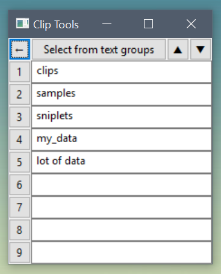

=========
ClipTools
=========

Goal
----

Clipboard manager with text processing tools.

Yes, there are many clipboard managers, but I had this idea, how to make it simple and effective. 

Programming language: Python and wxPython.

Test suite: Pytest

Inspiration
-----------

The book Fluent Python by Luciano Ramalho, http://bit.ly/fluentpy inspired me to start some new projects. I especially liked the unicode part, as the examples were really great and solved the problems what I have with the Hungarian language.

Thonny, Python IDE for beginners at https://thonny.org/ has interesting structure. I borrowed the starting part with the delegation handling sockets.

And of course Python and wxPython are great!

Concept
-------

App is listening to keyboard and collecting texts copied to the clipboard. It can also have collection of other useful texts. Beside texts, it has some actions, like uppercase, lowercase, backslash duplication, getting file content, etc.

Assign a keyboard shortcut to the ClipTools app. So you can bring it up just by a key combination. Then you can easily select a group of texts, the actual text, the processing action just by the number keys from 1 to 9. Finally the processed text result is copied to the clipboard and the app is minimized again.

Here is a screenshot, it is so simple:

Status
------

Work has just started, but I think it is already useful. I would say feasibility study was successful. And I'm also learning Github. Please be patient.

:-)

BigBirdCode
